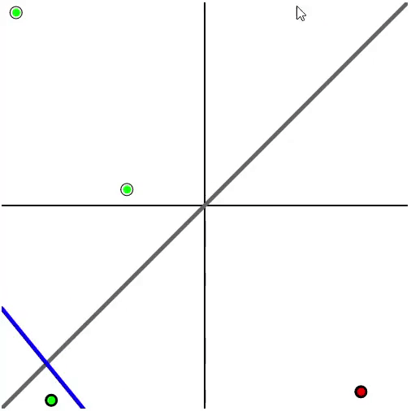

# neural-network
 
This project aimed to write perceptron and neural network classes from scratch, and then use them on classes toy problems such as linear/non-linear function approximation and digit recognition using the MNIST dataset.

The app can be found here: https://immodal.github.io/neural-network/

  

Figure 1: Handwritten digit recognition

  

Figure 2: Linear Function Approximator

